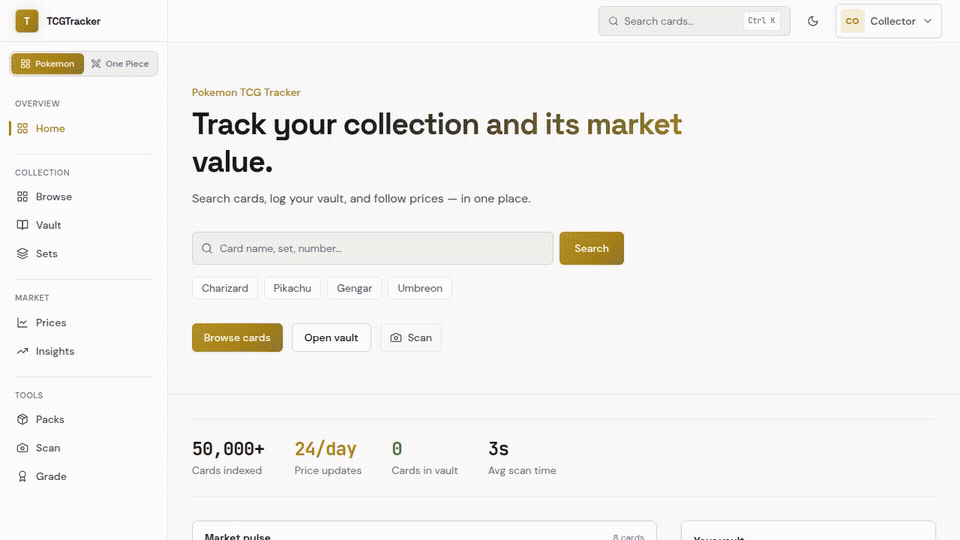
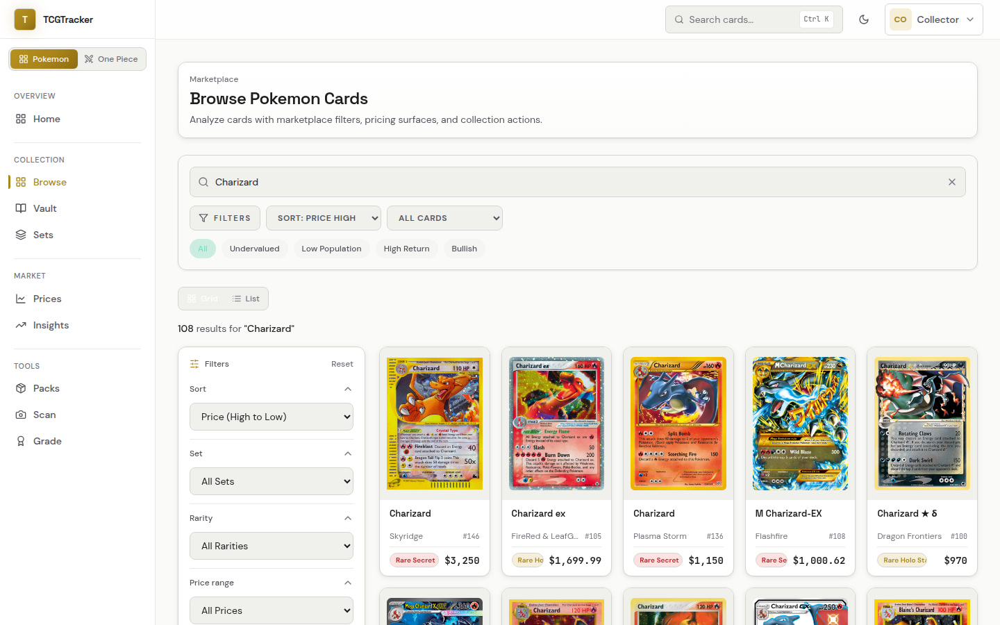
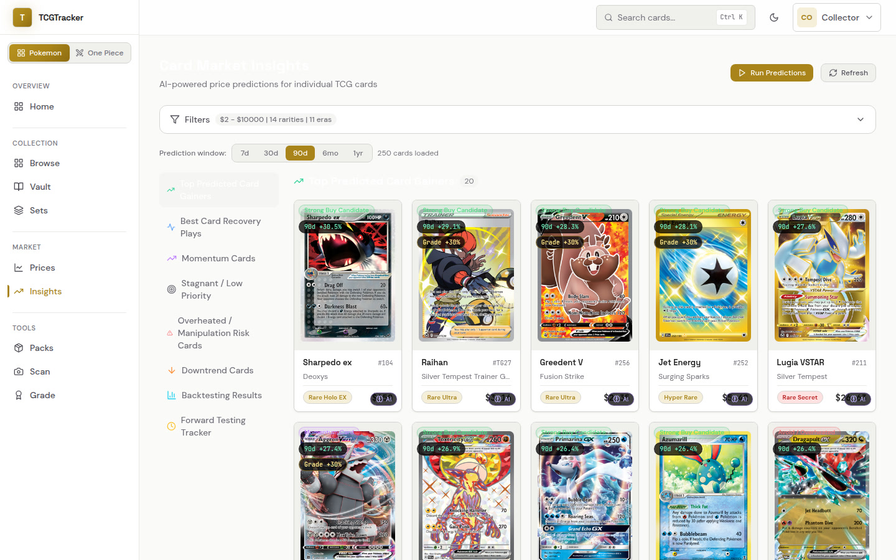
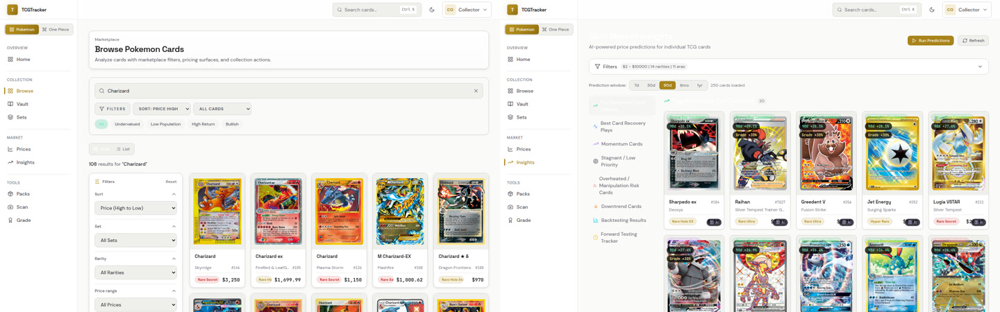
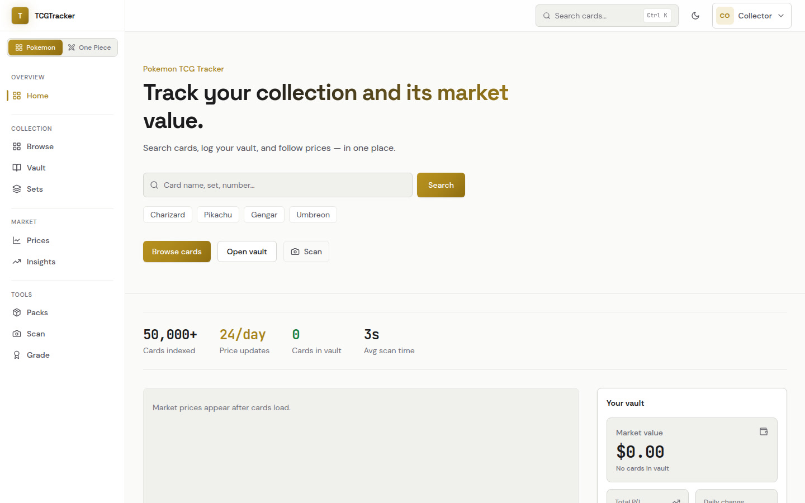
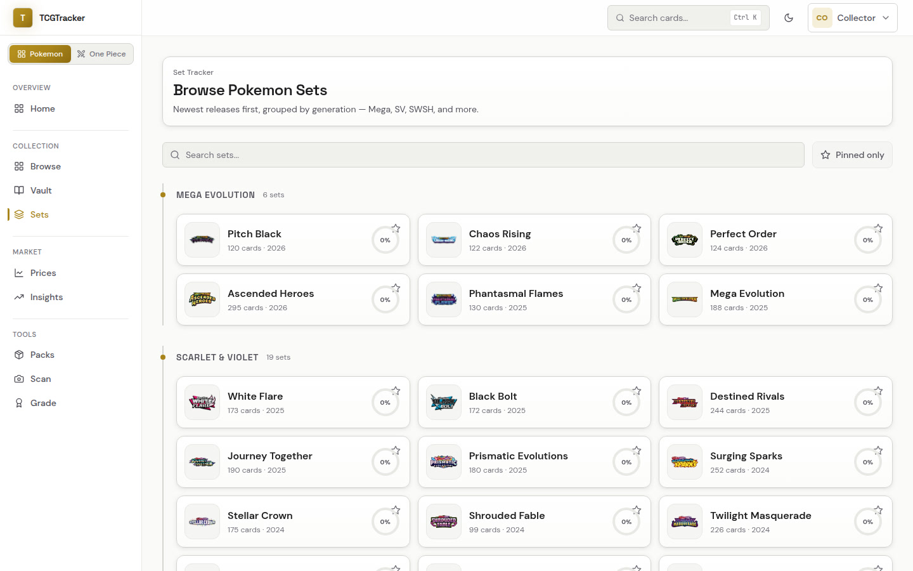
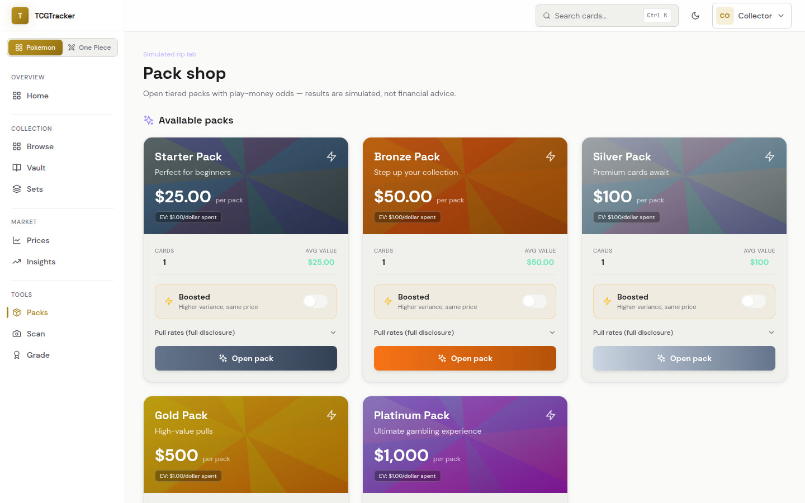
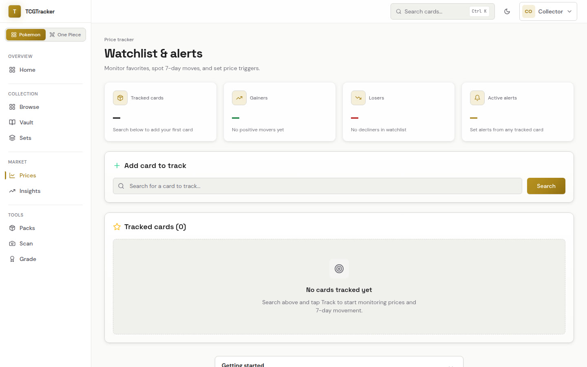
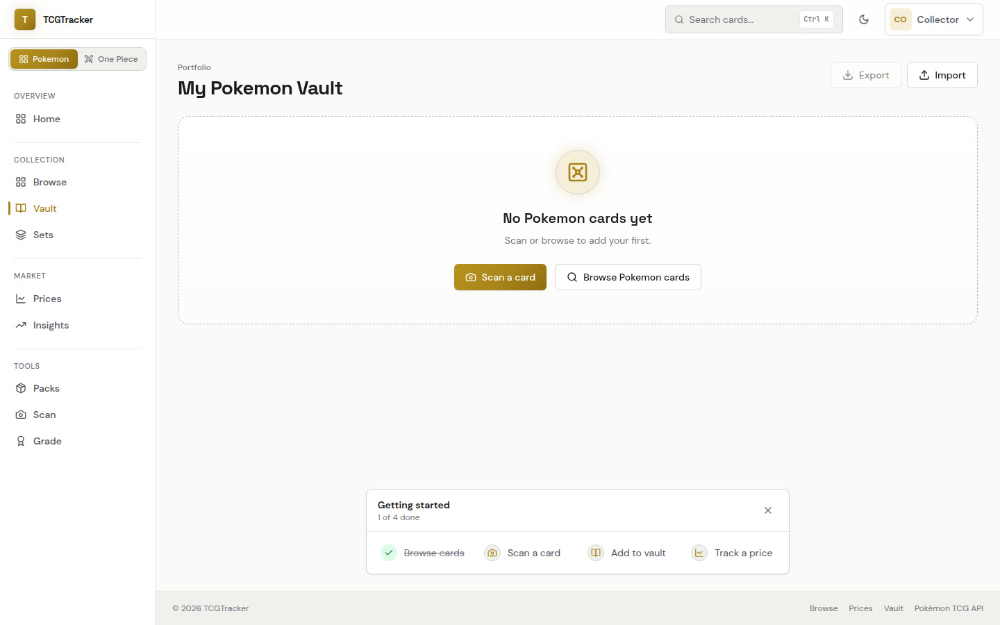
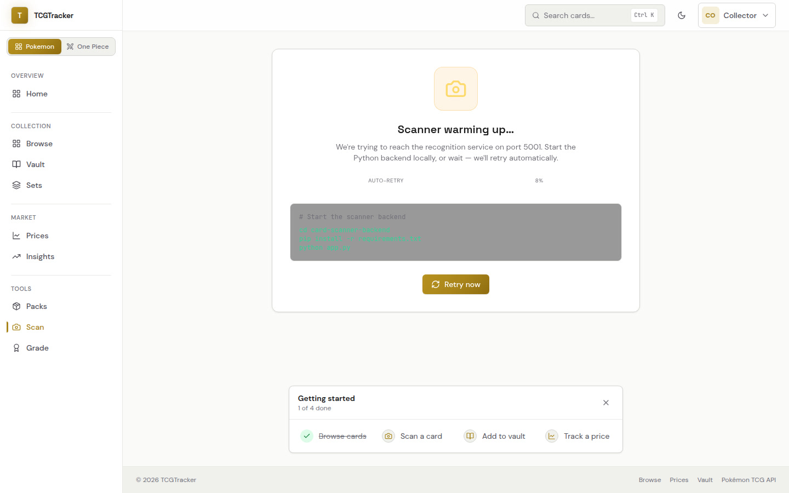

# TCGTracker

<div align="center">

**Track Pokemon & One Piece TCG collections, prices, and investment signals — in one place.**

[Live Demo](https://tcgtracker-pearl.vercel.app) · [Report Bug](https://github.com/Prayug/TCGTracker/issues) · [Request Feature](https://github.com/Prayug/TCGTracker/issues)

[](LICENSE)
[](https://react.dev)
[](https://www.typescriptlang.org/)
[](https://nodejs.org/)

<br />



</div>

---

## Overview

TCGTracker is a full-stack app for collectors and investors. Browse 50k+ cards, log a vault, watch prices, run AI market insights, open simulated packs, and scan cards from photos.

Supports **Pokemon** and **One Piece** via an in-app game switcher.

| | |
|:---:|:---:|
|  |  |
| **Browse & filter** marketplace listings | **AI insights** — buy / recovery / risk signals |

---

## Features

### Collection
- **Browse** — search by name/set/rarity with undervalued, population, and return filters
- **Vault** — log purchases, track portfolio value and P/L
- **Sets** — generation-grouped set tracker with completion rings

### Market
- **Price tracker** — watchlist, 7-day movers, and price alerts
- **Market insights** — AI predictions (7d → 1yr), recovery/momentum/overheat categories, backtests, and Groq-powered explanations

### Tools
- **Pack shop** — tiered simulated rips with boosted mode and cinematic 3D open (React Three Fiber)
- **Card scanner** — camera / upload recognition via a Python OCR backend

### Product polish
- Dark / light themes · command palette (`Ctrl/Cmd+K`) · responsive layout · JWT auth

<p align="center">
  
</p>

<details>
<summary><strong>More screenshots</strong></summary>

<br />

| Home | Sets |
|:---:|:---:|
|  |  |

| Pack shop | Price tracker |
|:---:|:---:|
|  |  |

| Vault | Scanner |
|:---:|:---:|
|  |  |

</details>

---

## Tech stack

| Layer | Stack |
| --- | --- |
| Frontend | React 18, TypeScript, Vite, Tailwind, Framer Motion, Recharts, React Three Fiber |
| Backend | Node 20, Express, SQLite, JWT, Zod, Winston, Swagger |
| Scanner | Python, Flask, EasyOCR / pokemon-card-recognizer |
| Ops | Docker Compose, GitHub Actions, Vercel (frontend) |

```
TCGTracker/
├── src/                    # React frontend
│   ├── features/
│   │   ├── cards/          # Browse
│   │   ├── market/         # Price tracker
│   │   ├── market-insights/# AI predictions
│   │   ├── vault/          # Collection
│   │   ├── sets/           # Set tracker
│   │   ├── packs/          # Pack simulator + 3D rip
│   │   └── scanner/        # Card scanner UI
│   ├── components/         # Shared layout & UI
│   └── services/           # API clients
├── backend/                # Express API + SQLite price DB
├── card-scanner-backend/   # Flask card recognition service
└── docs/assets/            # README screenshots & demo
```

---

## Quick start

### Prerequisites

- Node.js **20+** and npm **10+**
- Python **3.8+** (optional — only for the card scanner)
- Docker (optional)

### 1. Clone & install

```bash
git clone https://github.com/Prayug/TCGTracker.git
cd TCGTracker
npm install
cd backend && npm install && cd ..
```

### 2. Environment

```bash
cp .env.example .env
cp backend/.env.example backend/.env
```

Generate a JWT secret and put it in `backend/.env`:

```bash
openssl rand -hex 32
```

For local frontend-only work against a remote API, set in `.env`:

```env
# VITE_API_URL=https://your-backend.example.com
```

Otherwise the Vite dev server proxies `/api/*` to the local backend (`http://localhost:3001`).

### 3. Run

**Frontend + Node API** (recommended):

```bash
npm run dev:full
```

Or separately:

```bash
# Terminal 1 — API
cd backend && npm run dev

# Terminal 2 — UI
npm run dev
```

**Optional — card scanner:**

```bash
cd card-scanner-backend
python3 -m venv venv
source venv/bin/activate   # Windows: venv\Scripts\activate
pip install -r requirements.txt
python app.py              # http://localhost:5001
```

| Service | URL |
| --- | --- |
| Frontend | http://localhost:5173 |
| Backend API | http://localhost:3001 |
| API docs (Swagger) | http://localhost:3001/api-docs |
| Card scanner | http://localhost:5001 |

More scanner detail: [`card-scanner-backend/README.md`](./card-scanner-backend/README.md)

---

## Docker

```bash
docker-compose up -d
docker-compose logs -f
docker-compose down
```

---

## Scripts

```bash
npm run dev          # Vite frontend
npm run dev:full     # Frontend + backend together
npm run build        # Production frontend build
npm run lint         # ESLint
npm run format       # Prettier
npm run type-check   # tsc --noEmit
npm test             # Vitest
```

Backend:

```bash
cd backend
npm run dev
npm test
npm run build
```

---

## API snapshot

Interactive docs: `http://localhost:3001/api-docs`

| Area | Examples |
| --- | --- |
| Auth | `POST /api/auth/register`, `POST /api/auth/login`, `GET /api/auth/me` |
| Alerts | `GET/POST /api/alerts`, `PUT /api/alerts/:id/toggle` |
| Cards | `GET /api/cards/search`, `GET /api/cards/sets`, `GET /api/prices/:cardId` |
| Insights | Market prediction / backtest endpoints used by `/market-insights` |
| Cloud backup | `POST /api/cloud-backup`, `GET /api/cloud-backup/status` (when enabled) |

Protected routes expect:

```http
Authorization: Bearer <jwt>
```

---

## Deploy

- **Frontend** — [Vercel](https://vercel.com) (this repo includes `vercel.json`; live: [tcgtracker-pearl.vercel.app](https://tcgtracker-pearl.vercel.app))
- **Backend** — Railway, Render, Fly.io, or any Node host with persistent disk for SQLite

Production env highlights:

```env
# Frontend
VITE_API_URL=https://api.yourdomain.com

# Backend
NODE_ENV=production
JWT_SECRET=<min-32-char-secret>
CORS_ORIGIN=https://yourdomain.com
CLOUD_SYNC_ENABLED=true   # optional Supabase DB backups
```

---

## Contributing

1. Fork the repo
2. Create a branch: `git checkout -b feature/my-change`
3. Commit & push
4. Open a pull request

Please add tests for new logic and keep lint/format clean (`npm run lint`, `npm run format`).

---

## License

MIT — see [LICENSE](LICENSE).

## Author

**Prayug Sigdel**  
GitHub: [@Prayug](https://github.com/Prayug)

## Acknowledgments

- [pokemontcg.io](https://pokemontcg.io/) — card metadata & images
- [TCGCSV](https://tcgcsv.com/) — marketplace pricing
- Open-source libraries powering the UI, API, and scanner
